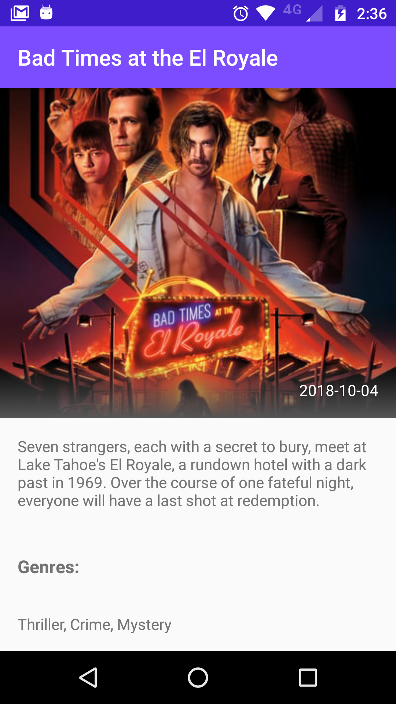

# Movies Test
MOBILE DEV CODE CHALLENGE using TheMovieDB's API.

## Main Objectives
- Create a movies list
{:height="50%" width="50%"}

- Show movie's details

- Allow to search movies by name

## Main Third Party Libraries
- **Retrofit:** To access web service's data.
- **ButterKnife:** To easily bind view's xml elements to the activities/fragments.
- **Picasso:** To obtain images via url.

